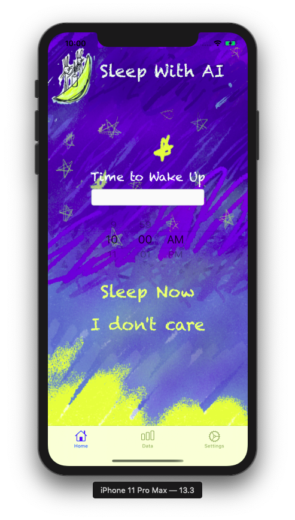
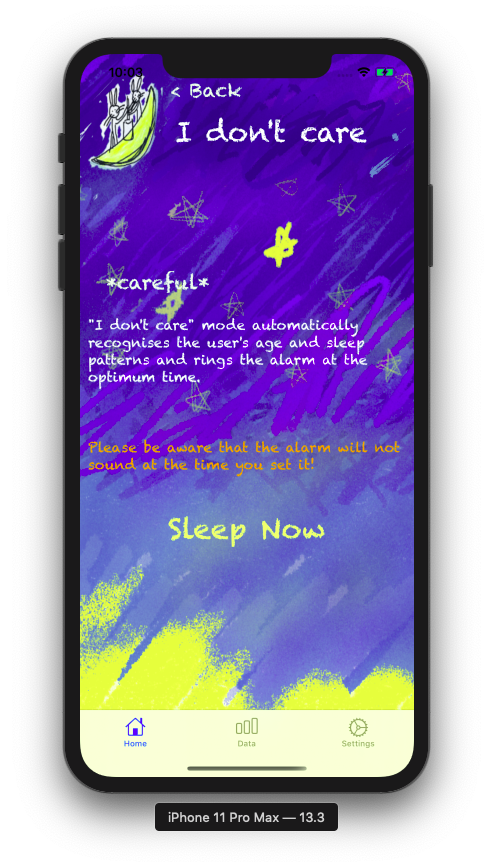

# SleepWithAI
  

**SleepWIthAI(A.K.A. SWAI)** is application iOS alarm app with personal data, powered by Core ML - Sound Classification.  
SWAI will recommend & turn on the alram at best time to wake up.

## Getting Started

You can see more detailed function at [SWAI Marketing Website](https://projectintheclass.github.io/SleepWithAI/)

### Installation 

[![download][1]][2]

[1]:AppStore_res/readme/Download_on_the_App_Store_Badge_US-UK_RGB_blk_092917.svg
[2]:https://apps.apple.com/app/id1498395373

You can install on iOS devices (iOS 14+, iPad also supported.) 

### How this Application Wake User

First of all, iPhone/iPad should be charged during sleeping.  
SWAI will indicate what's going on while you are sleeping with microphone recording.  
There are two main modes to wake up, **Normal mode** and **I Don't Care mode**.

* **Normal Sleep Mode**

  

Normal Sleep Mode is for who needs to wake up at certain time.  
User can set time at Home tab with date picker.  

* **I Don't Care Mode (A.K.A. IDC)**

  

I Don't Care Mode is for who doesn't need to wake up at certain time.  
Very opposite from Normal Sleep Mode, user doesn't need to set time to wake up.  

## Built With

* [Realm](http://www.realm.io/) - For User's Sleeping Data Process
* [CoreML](https://developer.apple.com/documentation/coreml) - Classifying Sleeping Status

## Authors

* **Wanki Kim** - [Github](https://github.com/KimWanki)

* **Yeonji Lim** - [Github](https://github.com/Ymin-dgnn)

* **Yangjin Cho** - [Github](https://github.com/sheepjin99) / [Twitter](https://twitter.com/riel_dev) / [Facebook](https://www.facebook.com/profile.php?id=100014648160911) / [Blog](https://sheepjin99.tistory.com)

See also the list of [contributors](https://github.com/ProjectInTheClass/SleepWithAI/pulse) who participated in this project.

## License

This project is licensed under the MIT License - see the [LICENSE](./LICENSE) file for details

## Acknowledgments

* [Sleepyti.me](https://www.sleepyti.me/) - Quite different from our project, but initial idea was from this website.
* [Charts](https://github.com/danielgindi/Charts) - Used Cocoapod Framework for showing sleeping sound data to user.
* [Sleep Foundation](https://www.sleepfoundation.org/press-release/national-sleep-foundation-recommends-new-sleep-times)
